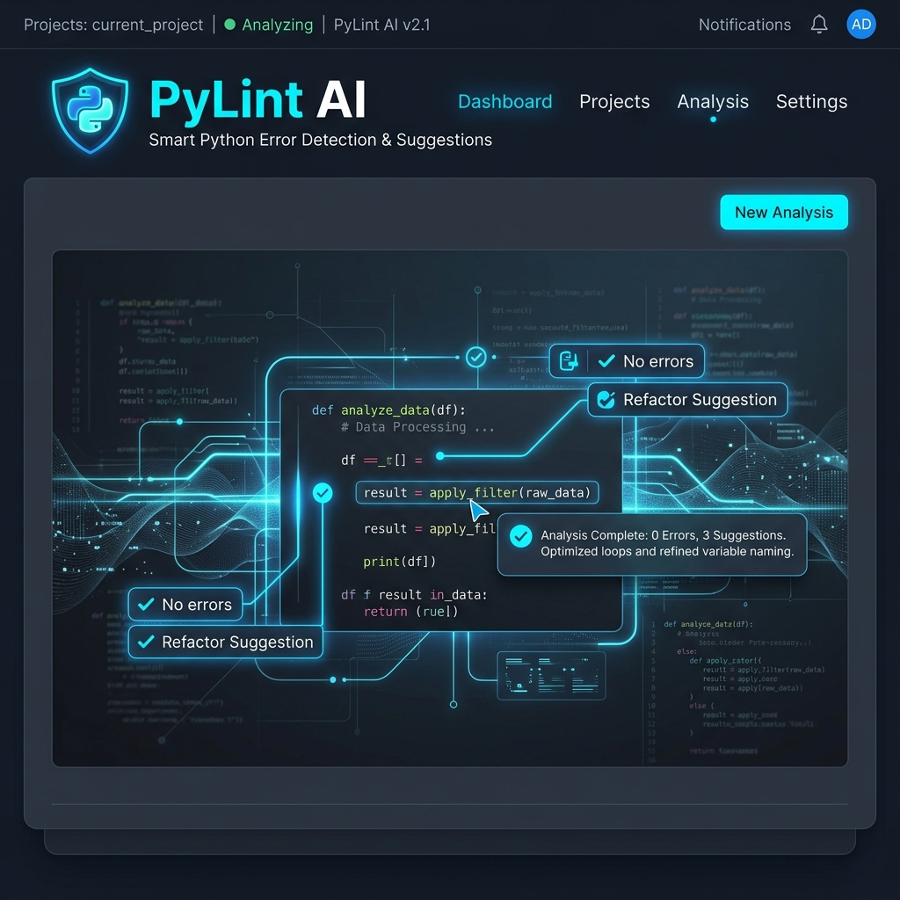

# 🐍 PyLint AI — Error Detection & Suggestion Tool



[](https://nextjs.org/)
[](https://www.typescriptlang.org/)
[](https://tailwindcss.com/)
[](https://opensource.org/licenses/MIT)

**PyLint AI** is a professional, sleek, and high-performance web application designed for Python developers. It leverages AI to provide deep code analysis, error detection, and intelligent refactoring suggestions within a beautiful, VS Code-inspired environment.

---

## 🌟 Key Features

### 🧠 Smart AI Analysis
- **Deep Error Detection**: Identifies logical bugs, syntax errors, and potential runtime issues.
- **Intelligent Suggestions**: Provides clear, actionable advice on how to fix and improve your code.
- **Problematic Code Highlighting**: Specifically targets and explains complex code segments.

### 💻 Modern Editor Experience
- **VS Code Theme**: Familiar dark-mode interface designed for long coding sessions.
- **Multi-File Support**: Manage multiple Python files with a tabbed interface and sidebar explorer.
- **Syntax Highlighting**: Real-time Python syntax coloring for enhanced readability.
- **Intelligent Status Bar**: 
  - **Dynamic Ln/Col Tracking**: Know exactly where your cursor is at all times.
  - **Auto-Indentation Detection**: Detects if your code uses 2, 4, or other spacing conventions.

### ⚡ Performance & Workflow
- **Batch Analysis**: Analyze all open files in a single pass.
- **Instant Code Copying**: One-click to copy fixed code to your clipboard.
- **File Management**: Create, rename, delete, and upload files directly through the browser.

---

## 🚀 Tech Stack

- **Framework**: [Next.js](https://nextjs.org/) (App Router & Turbopack)
- **Language**: [TypeScript](https://www.typescriptlang.org/)
- **Styling**: [Tailwind CSS](https://tailwindcss.com/)
- **Animations**: [Framer Motion](https://www.framer.com/motion/)
- **Icons**: [Lucide React](https://lucide.dev/) & Custom SVGs
- **UI Components**: [Shadcn/UI](https://ui.shadcn.com/)
- **Runtime**: [Bun](https://bun.sh/)

---

## 🛠️ Installation & Setup

Ensure you have [Bun](https://bun.sh/) or [Node.js](https://nodejs.org/) installed.

1. **Clone the Repository**
   ```bash
   git clone https://github.com/manmeet8549/Error_Detection_With_Suggestion.git
   cd Error_Detection_With_Suggestion
   ```

2. **Install Dependencies**
   ```bash
   bun install
   # or
   npm install
   ```

3. **Set Up Environment Variables**
   Create a `.env` file in the root directory and add your AI provider configuration (e.g., API keys).

4. **Run the Development Server**
   ```bash
   bun run dev
   # or
   npm run dev
   ```

5. **Build for Production**
   ```bash
   bun run build
   bun run start
   ```

---

## 📖 Usage

1. **Open the App**: Navigate to `http://localhost:3000`.
2. **Write or Upload Code**: Use the editor to write Python code or use the **Upload** button to import `.py` files.
3. **Analyze**: Click the blue **Analyze Code** button (or **Analyze All**) to start the AI analysis.
4. **Review Issues**: Problems will appear in the right panel with severity levels (Error, Warning, Info).
5. **Fix & Copy**: Read the suggestions, apply fixes, and use the **Copy** button to take your improved code.

---

## 🤝 Contributing

Contributions are welcome! If you'd like to improve PyLint AI:

1. Fork the Project.
2. Create your Feature Branch (`git checkout -b feature/AmazingFeature`).
3. Commit your Changes (`git commit -m 'Add some AmazingFeature'`).
4. Push to the Branch (`git push origin feature/AmazingFeature`).
5. Open a Pull Request.

---

## 📜 License

Distributed under the MIT License. See `LICENSE` for more information.

---

<p align="center">
  Developed with ❤️ for the Python Community
</p>
